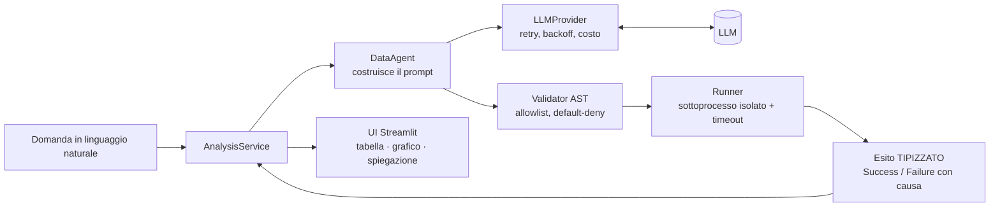

# Architettura e decisioni di progetto

Questo documento non elenca i file: racconta **le scelte che contano** e i loro
compromessi. È il "perché" dietro il codice — la parte che un README non copre e
che, in un progetto che genera ed esegue codice a partire da un LLM, fa la
differenza tra una demo e qualcosa che si può difendere.

---

## Cosa fa, in una frase

Interroghi un dataset in linguaggio naturale; un LLM traduce la domanda in codice
Pandas; il codice viene **validato ed eseguito in una sandbox**; l'app mostra il
risultato (tabella, grafico) e ne dà una lettura in italiano.

## Il principio guida: *Pandas calcola, l'AI racconta*

Il modello **non produce numeri**. Genera codice Pandas che li calcola, e poi
riceve i numeri già calcolati per commentarli. È un vincolo di design deliberato:
un LLM che "stima" un totale sbaglia in modo plausibile e invisibile; Pandas che lo
somma o è giusto o solleva un'eccezione. Tutta l'architettura discende da qui.

---

## Le decisioni che contano

### 1. Sicurezza: allowlist, non denylist

Il codice arriva da un LLM: va trattato come ostile. Il validatore statico
(`nlda/sandbox/validator.py`) ispeziona l'AST e **rifiuta tutto ciò che non è
esplicitamente ammesso**.

- **Perché allowlist e non denylist.** Una lista di costrutti *vietati* descrive
  gli attacchi che conosciamo oggi e resta indietro a ogni evoluzione di Python
  (match, walrus, async, e ciò che arriverà). Elencando invece la manciata di nodi
  che servono a un'espressione Pandas, `def`/`class`/`import`/`with`/`try` e i
  costrutti futuri restano fuori **per costruzione**, senza doverli prevedere.
- **Trade-off dichiarato.** L'AST vede la *sintassi*, non l'I/O interno a una
  libreria: `px.data.gapminder()` o `fig.show()` passano il validatore ed eseguono
  I/O *dentro* la chiamata. La chiusura vera non è statica — è l'isolamento del
  sistema operativo (Docker, punto 2).

### 2. Isolamento: una barriera di processo, onestamente non di sistema

Il codice validato gira in un **sottoprocesso dedicato**
(`nlda/sandbox/runner.py` + `_sandbox_worker.py`) con timeout e, su POSIX, un cap
di memoria. Due scelte di dettaglio che valgono più di quanto sembri:

- **Il canale di ritorno worker → padre trasporta solo JSON, mai pickle.** Quel
  processo ha appena eseguito codice non fidato: un pickle ostile scritto lì
  verrebbe *eseguito* nel processo padre (pickle costruisce oggetti), annullando
  l'isolamento. La direzione opposta (padre → worker) resta pickle perché la
  sorgente è fidata e preserva i dtype del DataFrame.
- **Limite noto e dichiarato:** è una barriera *di processo*, non *di sistema*. Su
  Windows, fuori dal container, non c'è cap di RAM (`resource` è POSIX-only).
  L'isolamento vero è il `Dockerfile` con `read_only`, `cap_drop: ALL`,
  `no-new-privileges`, utente non-root e `mem_limit`. Dichiararlo è parte della
  soluzione, non una nota a piè di pagina.

### 3. Affidabilità: l'esito è un TIPO, non una stringa

L'esecuzione ritorna `ExecutionSuccess` **o** `ExecutionFailure(kind, ...)`, mai un
`dict | str` da cui indovinare l'errore dal prefisso del messaggio
(`nlda/results.py`). Sul `kind` — la *causa* — si prendono le decisioni:

- Un fallimento `syntax`/`runtime` è un difetto del codice generato: **rigenerarlo
  ha senso** → `retryable = True`.
- Un rifiuto della sandbox (`security`), un `timeout`, un `provider` irraggiungibile
  **non** dipendono dalla formulazione del codice: ritentare brucerebbe solo
  chiamate all'LLM → `retryable = False`.

Questo chiude un bug reale: prima un rifiuto di sicurezza finiva nel retry come
qualunque errore e bruciava tre chiamate per rigenerare codice che la stessa regola
avrebbe ribloccato.

### 4. Astrazione dei provider: Template Method + Strategy + Factory

`nlda/providers/base.py` centralizza in un unico *template method* ciò che vale per
**tutti** i provider — timeout, retry con backoff, misura della latenza, stima del
costo — mentre ogni sottoclasse implementa solo la chiamata grezza all'SDK. Un
provider nuovo si aggiunge in poche righe (`GroqProvider` riusa tutto ereditando da
`OpenAIProvider`: cambia solo la `base_url`).

- **Retry mirato:** non si ritenta su errori non transitori (401 chiave errata, 404
  modello inesistente). La classificazione avviene per **codice HTTP**, con
  duck-typing, *senza importare gli SDK* in `base.py` (che resta a import lazy).

### 5. Osservabilità: logging strutturato e costo per turno

`nlda/log.py` emette, a scelta, testo leggibile o **una riga JSON per evento**.
Ogni turno gira sotto un `turn_id` propagato automaticamente da un `contextvar`:
generazione del codice, tentativi di correzione e chiamate al provider riportano lo
stesso id, così una richiesta lenta o fallita si ricostruisce filtrando su un solo
campo. I token sono catturati **separando input e output** (pesano diversamente) e
tradotti in `cost_usd`: il linguaggio con cui si ragiona il costo di una soluzione
LLM a regime.

### 6. Performance: pagare i costi fissi altrove

- **Riserva calda di worker** (`nlda/sandbox/pool.py`): l'avvio di un interprete che
  importa pandas + plotly costa ~840 ms. Si tiene pronto **un** processo che ha già
  importato tutto e dorme su stdin; ogni domanda lo consuma e ne fa preparare un
  altro in background. Misurato nel container: **1132 ms → 169 ms**. Ogni esecuzione
  resta però in un processo **fresco** — l'isolamento non è barattato con la
  velocità.
- **Firma del dataset O(1)** (`nlda/loader.py`): Streamlit ri-esegue lo script a
  ogni interazione. La firma che invalida le cache campiona prime+ultime 200 righe
  invece di hashare tutto: **da 167 ms a 1,6 ms**, costante da 200k a 5M righe.

### 7. Testabilità: verificare ciò che di solito nessuno verifica

- **Golden dei prompt.** Il testo dei prompt è l'unico artefatto che nessun test
  normalmente esercita (la suite sostituisce il provider con un finto). Un golden
  confronta il prompt renderizzato carattere per carattere: una modifica accidentale
  si vede come diff e va confermata. Nasce da un incidente reale — una sostituzione
  automatica aveva corrotto una frase del prompt con tutta la suite verde.
- **Contract test sugli SDK.** Un client finto cattura gli argomenti passati e li
  verifica contro la firma *reale* dell'SDK installato (`inspect.signature`). Un
  major che rinomina un parametro diventa rosso a costo zero — nessuna chiave,
  nessuna rete.
- **Property/fuzz sul validatore.** `hypothesis` genera migliaia di espressioni,
  mescolando frammenti leciti e di fuga, e verifica l'invariante *nessun codice
  accettato accede a `__`/import/I-O*, con un oracolo indipendente dalla walk del
  validatore.

---

## Estensioni deterministiche, senza toccare il cuore

Le funzionalità aggiunte seguono tutte lo stesso principio: **preprocessing del
DataFrame**, così la pipeline a un solo `df` (sandbox, prompt, service) non cambia.

- **Filtro persistente:** restringe il `df` che alimenta l'intera pagina; il service
  resta *stateless* (riceve `df[mask]`). La firma per azzerare la conversazione si
  calcola sul df *intero*, così cambiare filtro non cancella lo storico.
- **Confronto tra periodi:** `compare_periods` (mese/trimestre/anno + variazione %)
  è un helper deterministico **esposto anche al codice generato** e testato — il
  modello non reinventa il calcolo a ogni domanda.
- **Join tra dataset:** un secondo file viene unito a monte in **un** DataFrame; il
  resto dell'app non sa nemmeno che c'erano due file.

---

## Limiti noti (dichiarati, non nascosti)

- La correttezza dipende dal modello: i test verificano la *struttura* dei prompt e
  la *pipeline*, non che un modello piccolo produca sempre la risposta giusta. Uno
  strato di `eval` coglie il "eseguibile ma sbagliato", ma solo su un insieme fisso
  di domande.
- La sandbox statica non vede l'I/O interno alle librerie: l'isolamento forte è il
  container.
- Su Windows fuori dal container non c'è cap di memoria sul worker.
- La tabella prezzi per la stima del costo è un listino indicativo, da riverificare.

---

## Stack

Python 3.12–3.14 · Streamlit · Pandas · Plotly · SDK provider opzionali (OpenAI,
Anthropic, Google Gemini, Groq, Ollama locale). Test con pytest + hypothesis,
type-check mypy, lint ruff, CI su GitHub Actions (matrix, build Docker, scansioni
di sicurezza), pacchetto installabile via `pyproject`.
