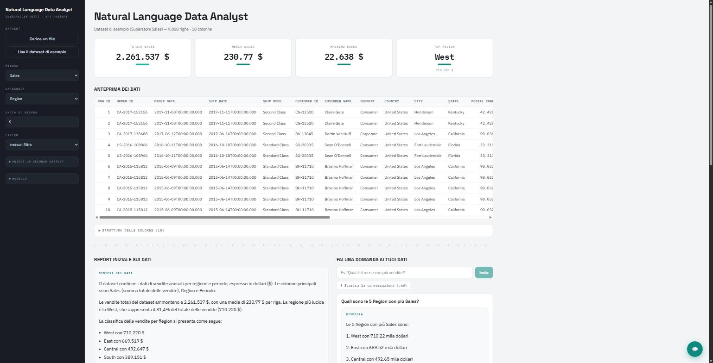
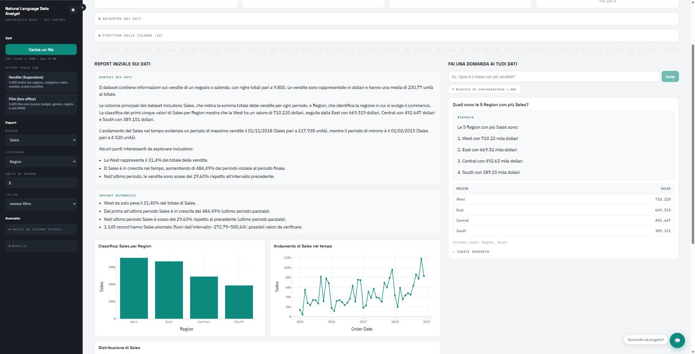
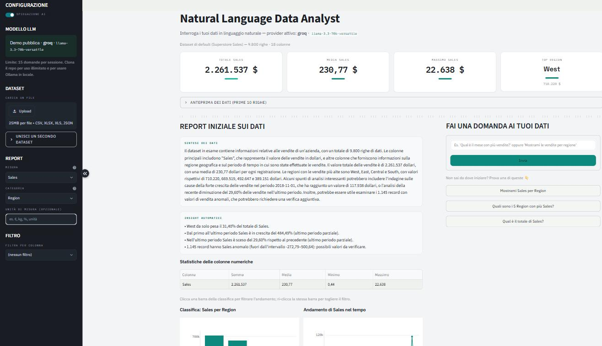
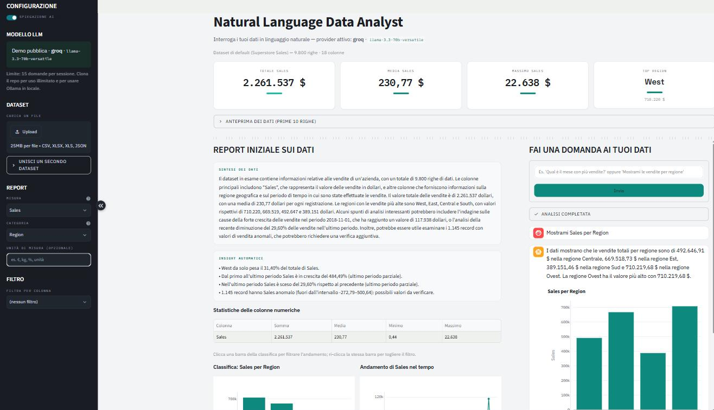

# Natural Language Data Analyst

[](https://github.com/raffaeleciccone-analyst/Natural-Language-Data-Analyst/actions/workflows/ci.yml)
[](https://www.python.org/downloads/)
[](frontend/)
[](LICENSE)

**Interroga i tuoi dati in linguaggio naturale.** Fai una domanda — *"Qual è il
mese con più vendite?"* — e un modello LLM la traduce in codice Pandas, che l'app
esegue in una sandbox. Ottieni il risultato, un grafico Plotly e una risposta che
interpreta i numeri.

**I numeri li calcola Pandas; l'AI si limita a raccontarli.**

## ▶️ [Prova la demo → nlda.onrender.com](https://nlda.onrender.com)

Carica un CSV, oppure parti da uno dei due dataset di esempio. Nessuna
registrazione, nessuna chiave da inserire.

> Gira sul piano gratuito di Render. Nei giorni feriali dalle 7 alle 22 resta
> sveglia; fuori da quella finestra si spegne dopo 15 minuti di inattività e
> **la prima visita attende circa un minuto** l'avvio
> ([perché non sempre](DEPLOY.md#tenerla-sveglia-negli-orari-che-contano)).
> Le domande all'AI hanno un tetto giornaliero condiviso — è la chiave del
> manutentore a pagarle ([perché](DEPLOY.md#il-tetto-di-spesa)).

<table>
<tr>
<td width="50%">

### Due interfacce

La demo qui sopra è quella **React + FastAPI**, l'interfaccia principale.

Esiste anche una **[versione Streamlit](https://natural-language-data-analyst-v1.streamlit.app/)**
sullo stesso identico backend: stessi numeri, stesse risposte, meno controllo sul
rendering. Non è un residuo — è la prova che la stratificazione dichiarata era
vera ([confronto](#le-due-interfacce)).

</td>
<td width="50%">

### 📄 Approfondisci

**[Perché questo progetto](VALUE.md)** · il problema e il valore

**[Architettura](ARCHITECTURE.md)** · le decisioni e i loro trade-off

**[Modello di minaccia](THREAT_MODEL.md)** · superfici, mitigazioni, rischi residui

**[Documentazione tecnica](docs/DOCUMENTAZIONE_TECNICA.md)** · modulo per modulo

</td>
</tr>
</table>




*Interfaccia React, screenshot reali. In alto i KPI e l'anteprima del file; sotto,
a sinistra la sintesi scritta dall'AI sui numeri calcolati da Pandas, a destra una
domanda con la risposta e la tabella che l'ha prodotta.*

<details>
<summary>Gli stessi dati nell'interfaccia Streamlit</summary>




</details>

---

## Cosa sa fare

| | |
|---|---|
| **Domande in linguaggio naturale** | La domanda diventa codice Pandas, che viene eseguito: risultato, grafico interattivo e risposta testuale **in streaming**. |
| **Report automatico** | KPI, statistiche, classifiche, andamento nel tempo, correlazioni e distribuzioni — appena carichi un file, senza chiedere nulla. |
| **Insight automatici** | Quota del leader, crescita di periodo, variazione recente e outlier: **calcolati in Pandas**, non dedotti dall'AI. |
| **Report esecutivo** | Cinque sezioni pronte da presentare (Summary, Insights, Recommendations, Risks, Next Steps), scaricabili in Markdown. |
| **Filtro globale** | Restringi l'intera analisi a un sottoinsieme: vale per report, KPI, confronto e domande. Cliccare una barra della classifica lo imposta, e la classifica resta intera con quella barra in evidenza. |
| **Confronto tra periodi** | Una misura per mese, trimestre o anno con la variazione sul periodo precedente — dalla sezione dedicata o chiedendolo a parole. |
| **Unione di due file** | Carica un secondo dataset e uniscilo al primo su una coppia di chiavi; da lì in poi report e domande valgono sui dati uniti. |
| **Esporta la conversazione** | Ogni turno in Markdown, **codice Pandas generato compreso**. |
| **Multi-provider LLM** | Ollama (locale, senza chiave), Groq, Anthropic, OpenAI, Gemini. Gli SDK sono opzionali: si installa solo quello che serve. |
| **Chiedi al progetto** | Una modalità che risponde sul progetto stesso citando le fonti, con recupero TF-IDF sui documenti del repo. |
| **Due dataset di esempio** | Vendite (9.800 ordini) e film (1.830 titoli del decennio 2000-2009, con incassi e voti): domini diversi, per mostrare che il rilevamento di misure, categorie e date non è tarato su un file solo. |
| **Tema chiaro e scuro** | Parte dalla preferenza di sistema; grafici compresi. |

**Formati**: CSV, Excel (`.xlsx`/`.xls`), JSON. Tipi, date e colonne "misura"
vengono rilevati da soli, e lo schema reale finisce nel prompt a ogni domanda.

## Le due interfacce

Lo stesso backend, servito a due frontend diversi. Non è una vetrina: è la prova
che la stratificazione dichiarata era vera — `nlda/api/app.py` non contiene
logica, solo traduzione da e verso JSON.

| | **React + FastAPI** — principale | **Streamlit** — secondaria |
|---|---|---|
| Demo | **[nlda.onrender.com](https://nlda.onrender.com)** | [su Streamlit Cloud](https://natural-language-data-analyst-v1.streamlit.app/) |
| Dove | `frontend/` + `nlda/api/` | `main.py` + `nlda/ui/` |
| Avvio | `uvicorn nlda.api.app:app` | `streamlit run main.py` |
| Porta | 8000 | 8501 |
| Punti forti | controllo pieno del rendering, nessuno scatto della pagina durante il caricamento, risposta in streaming, tema chiaro/scuro | zero codice di interfaccia, ideale per iterare in fretta |

Perché la seconda resta: **è la verifica del confine**. Finché due frontend
diversi producono gli stessi numeri chiamando le stesse funzioni, "il backend non
conosce l'interfaccia" è un fatto verificabile e non una dichiarazione. Il giorno
in cui divergessero, lo si scoprirebbe aprendo due schede.

Sono avviabili **dalla stessa immagine Docker**: cambia il comando, non
l'immagine.

## Esecuzione in locale

### 1. Installazione

```bash
git clone https://github.com/raffaeleciccone-analyst/Natural-Language-Data-Analyst.git
cd Natural-Language-Data-Analyst

python -m venv .venv
# Windows:  .venv\Scripts\activate
# macOS/Linux:  source .venv/bin/activate

pip install -e ".[all,api]"
```

`[all]` installa gli SDK di tutti i provider, `[api]` FastAPI e uvicorn. Puoi
prendere solo ciò che ti serve — `".[ollama]"`, `".[openai]"` (copre anche Groq),
`".[anthropic]"`, `".[gemini]"`: l'import di ogni SDK avviene solo quando scegli
quel provider.

### 2. Un modello LLM

**Ollama in locale** (gratuito, nessuna chiave) — installalo da
<https://ollama.com>, poi `ollama pull qwen2.5:3b`. È già il provider predefinito.

**Oppure un provider cloud** — scegli Groq, Anthropic, OpenAI o Gemini
dall'interfaccia e incolla la chiave (o mettila in `.env`, copiando
`.env.example`). Groq ne offre una gratuita senza carta su
<https://console.groq.com/keys>.

### 3. Avvia

```bash
# Interfaccia React (richiede il frontend compilato: vedi sotto)
uvicorn nlda.api.app:app --reload          # http://localhost:8000

# Interfaccia Streamlit
streamlit run main.py                      # http://localhost:8501
```

<details>
<summary><b>Sviluppare il frontend React</b></summary>

Serve **Node 20+**. In sviluppo girano due processi: Vite serve la pagina con
l'hot reload e inoltra `/api` a uvicorn.

```bash
cd frontend
npm install
npm run dev        # http://localhost:5173, con /api verso :8000
```

Per la versione compilata (quella che uvicorn serve da solo su `:8000`):

```bash
npm run build      # produce frontend/dist
```

I tipi TypeScript dell'API **si generano dallo schema OpenAPI**, non si scrivono
a mano:

```bash
python scripts/genera_tipi_ts.py             # rigenera frontend/src/api/types.ts
python scripts/genera_tipi_ts.py --verifica  # fallisce se sono disallineati (gira in CI)
```

Così un campo rinominato nel backend rompe il *type-check* del frontend invece di
rompersi in produzione.

</details>

## Docker

```bash
GROQ_API_KEY=gsk_... docker compose up --build
```

Il container non serve solo alla portabilità: **è ciò che dà alla sandbox
l'isolamento dal sistema**. La validazione AST decide cosa il codice generato può
*dire*, il container decide cosa può *fare*. In `docker-compose.yml`:

- filesystem **in sola lettura** (le sole aree scrivibili sono tmpfs volatili);
- utente **non privilegiato** (uid 10001) e **tutte le capability rimosse**;
- `no-new-privileges`, tetto di RAM e limite di processi (niente fork-bomb);
- `ALLOW_INPROCESS_FALLBACK=false`: fail-closed, l'esecuzione si blocca invece
  di degradare a una sandbox più debole.

Chiude anche il residuo che l'AST non può coprire: una chiamata di libreria che fa
I/O al proprio interno (`px.data.gapminder()`) non è visibile al validatore, ma
resta confinata dal container.

Una sola immagine, due interfacce:

```bash
docker run -p 8000:8000 nlda                                    # React + API (default)
docker run -p 8501:8501 nlda streamlit run main.py \
  --server.address=0.0.0.0 --server.port=8501                   # Streamlit
```

## Sicurezza

> 🛡️ Il **modello di minaccia completo** — superfici d'attacco, mitigazioni e
> *rischi residui dichiarati* — è in **[THREAT_MODEL.md](THREAT_MODEL.md)**.

Il cuore: il codice generato dall'LLM non è fidato, e il progetto lo tratta come
tale in tre strati indipendenti.

1. **Analisi statica in allowlist.** Il validatore ammette solo la manciata di
   nodi AST che servono a un'espressione Pandas. Tutto il resto è rifiutato *per
   costruzione* — `import`, `def`, `class`, `with`, `try`, `global`, `del`,
   `async`, walrus, `match` — compresi i costrutti che il linguaggio aggiungerà
   in futuro. Una denylist andrebbe aggiornata a ogni versione di Python; questa
   no.
2. **Barriera di processo.** L'esecuzione avviene in un sottoprocesso dedicato
   con timeout, che restituisce al padre **solo JSON** — mai `pickle`. Il padre
   non ricostruisce nulla scelto dal processo che ha appena eseguito codice non
   fidato: se un domani la sandbox venisse forzata, questa barriera regge invece
   di cadere insieme a essa.
3. **Confine di container.** È l'unico strato che dà un vero isolamento dal
   sistema — vedi [Docker](#docker).

<details>
<summary><b>Il dettaglio degli altri controlli</b></summary>

- **Whitelist di builtin** minimale nell'ambiente di esecuzione.
- Sui nodi ammessi valgono regole mirate: niente attributi privati/dunder,
  niente metodi di I/O (`to_*`/`read_*`/`write_*` su file o rete, con una
  whitelist di convertitori puri in memoria), niente esecuzione dinamica
  (`eval`, `exec`, `query`, `format`).
- **Namespace d'esecuzione protetto**: l'allowlist controlla i *tipi di nodo*,
  non quale oggetto una catena di attributi raggiunge — da `px`/`pd`/`go` si
  arriverebbe a `os`/`subprocess` traversando i sottomoduli (`px.np.f2py`,
  `px.data.os`). Per questo sono esposti tramite un wrapper che nega l'accesso ai
  sottomoduli, e resta tale anche via alias.
- **Limite di memoria del worker** con `RLIMIT_AS`. *Limite noto:* esiste solo su
  POSIX; **su Windows il modulo `resource` non c'è, quindi il worker è contenuto
  dal solo timeout**. Nel container il worker gira su Linux, quindi il cap torna
  attivo anche su host Windows.
- **Fail-closed opzionale**: se il sottoprocesso non è avviabile l'esecuzione
  ripiega in-process (senza timeout né cap di memoria). In deploy pubblico si
  disattiva con `ALLOW_INPROCESS_FALLBACK=false`.
- I valori di esempio inseriti nel prompt sono **sanitizzati**, per mitigare la
  prompt injection dai file caricati.
- La **chiave API non viene mai salvata**: viaggia in un header per la singola
  richiesta, non entra nel magazzino, non compare nei log, non torna in nessuna
  risposta. Nel frontend resta nello stato del componente e non in
  `localStorage`, che qualunque script della pagina potrebbe leggere.

</details>

## Architettura

> 📐 Per **le decisioni e i loro trade-off** (perché allowlist e non denylist,
> perché il canale di ritorno è solo JSON, perché l'esito è un tipo) vedi
> **[ARCHITECTURE.md](ARCHITECTURE.md)**.

Il flusso di una domanda: l'agente costruisce un prompt con lo schema reale del
dataset (nomi **e** valori delle colonne, sanitizzati), il provider LLM genera il
codice, l'executor lo valida con l'allowlist AST e lo esegue in un sottoprocesso
con timeout; se fallisce per un motivo correggibile il codice viene rigenerato e
ritentato, altrimenti il turno si chiude. Il risultato torna all'interfaccia
insieme al riepilogo che l'AI usa per la risposta testuale.

```
nlda/                      il backend — non sa quale interfaccia lo stia usando
├─ service.py              orchestrazione del turno (domanda → codice → esito → spiegazione)
├─ agent.py                traduzione domanda → codice Pandas, adattata allo schema
├─ prompts/                i system prompt versionati (con golden a protezione)
├─ providers/              astrazione multi-LLM (ollama, groq, anthropic, openai, gemini)
├─ sandbox/
│  ├─ validator.py         allowlist di nodi AST: decide se il codice è ammissibile
│  ├─ runner.py            esecuzione nel sottoprocesso e canale di ritorno JSON
│  └─ pool.py              riserva calda di worker (toglie l'avvio dal percorso critico)
├─ loader.py               lettura multi-formato, profilo del dataset, analisi automatica
├─ kpis.py                 costruzione dei KPI del report
├─ views.py                filtro e unione di dataset (funzioni pure)
├─ charts.py               figure Plotly e loro aspetto
├─ periods.py              confronto tra periodi con variazione %
├─ project_qa.py           "Chiedi al progetto": recupero TF-IDF sui documenti del repo
├─ suggestions.py          domande di esempio e frequenze, condivise dalle due interfacce
├─ export.py               esportazione della conversazione in Markdown
├─ results.py              esito tipizzato dell'esecuzione (successo / fallimento con causa)
├─ sanitize.py             difesa dai dati non fidati che finiscono nel prompt
├─ pricing.py              stima del costo in USD di una chiamata (token → prezzo)
├─ demo.py                 quota della demo pubblica
├─ config.py               configurazione centralizzata da variabili d'ambiente
└─ log.py                  logging strutturato JSON con correlation-id e costo

nlda/api/                  interfaccia HTTP — traduzione da e verso JSON, nessuna logica
├─ app.py                  le rotte
├─ models.py               i modelli Pydantic da cui nascono i tipi TypeScript
├─ streaming.py            Server-Sent Events: avanzamento, risultato, testo a pezzi
├─ store.py                magazzino in memoria dei dataset (impronta del contenuto, LRU + TTL)
└─ quota.py                tetto di spesa della demo pubblica

frontend/src/              interfaccia React — nessuna decisione sui dati, solo resa
├─ App.tsx                 lo stato della schermata e la sua composizione
├─ api/client.ts           unico punto in cui si parla con il backend
├─ api/types.ts            GENERATO dallo schema OpenAPI: non modificare a mano
└─ components/             KPI, grafici, tabelle, filtro, chat, pannelli

main.py + nlda/ui/         interfaccia Streamlit
scripts/                   generazione dei tipi, dataset di esempio, corpus, smoke, eval, analisi log
tests/                     suite pytest (con focus sulla sandbox di sicurezza)
```

## Sviluppo e qualità

```bash
pip install -e ".[all,api,dev]"
pytest                          # test, inclusi quelli di sicurezza sul validatore
ruff check .                    # lint
mypy nlda main.py               # type-check
cd frontend && npm run typecheck && npx oxlint src
```

<details>
<summary><b>Come si verifica un'app che dipende da un modello</b></summary>

Un test che sostituisce l'LLM con un finto non tocca né il testo del prompt né la
forma reale delle risposte: è un punto cieco in cui i difetti passano con la suite
verde. Qui la verifica è a strati, dal più deterministico al più incerto.

| Strato | Cosa garantisce | Dove |
|---|---|---|
| **Golden dei prompt** | nessuna modifica accidentale al testo delle istruzioni | `tests/test_prompt_contract.py` |
| **Contratti prompt ↔ runtime** | ciò che il prompt promette esiste, e il codice che insegna supera la sandbox | idem |
| **Property/fuzz sul validatore** | migliaia di espressioni generate: nessun codice *accettato* accede a `__`/import/I-O | `tests/test_validator_fuzz.py` |
| **Corpus rigiocato** | risposte reali registrate attraversano l'intera pipeline in modo deterministico | `tests/test_corpus_replay.py` |
| **Smoke** | con un modello vero, ogni domanda produce un risultato valido | `scripts/smoke.py` |
| **Eval** | le risposte sono *corrette*, non solo eseguibili | `scripts/eval.py` |

```bash
pytest                                      # i primi quattro strati, in CI
python scripts/smoke.py                     # richiede un modello raggiungibile
python scripts/eval.py                      # punteggio di correttezza
python scripts/record_corpus.py             # rigenera il corpus registrato
```

Gli ultimi due parlano con un servizio esterno: girano in un workflow notturno
separato (`.github/workflows/smoke.yml`), non sulle pull request. L'eval in
particolare è una **misura**, non un test: il punteggio dipende dal modello e
oscilla. Serve a confrontare provider e ad accorgersi se un cambio al prompt
peggiora le risposte.

</details>

Ogni push esegue in CI (`.github/workflows/ci.yml`):

- **test** sulle tre versioni supportate (3.12, 3.13, 3.14);
- **lint e type-check** su Python (ruff, mypy) e TypeScript (tsc, oxlint);
- **immagine Docker**: build, avvio e verifica che l'HEALTHCHECK diventi sano e
  che la sandbox funzioni dentro il container;
- **sicurezza**: `pip-audit` sulle dipendenze e `bandit` sul codice.

<details>
<summary><b>Configurazione da variabili d'ambiente</b></summary>

I parametri di runtime sono centralizzati in `nlda/config.py`:

| Variabile | A cosa serve |
|---|---|
| `EXEC_TIMEOUT` | secondi concessi al codice generato |
| `MEMORY_LIMIT_MB` | tetto di RAM del worker (solo POSIX) |
| `ALLOW_INPROCESS_FALLBACK` | `false` = fallisci chiuso invece di degradare la sandbox |
| `LLM_REQUEST_TIMEOUT`, `LLM_MAX_RETRIES` | timeout e ritentativi verso il provider |
| `MAX_ROWS`, `MAX_COLUMNS` | limiti sul file caricato: soglie di *usabilità*, non di memoria |
| `LOG_LEVEL`, `LOG_FORMAT` | `json` emette una riga strutturata per evento, con `turn_id`, latenza, token e costo stimato |
| `PROVIDER`, `MODEL` | quale modello usare quando il client non lo specifica |
| `DEMO_MODE`, `DEMO_MAX_QUESTIONS`, `DEMO_MAX_DAILY` | quota della demo pubblica (vedi [DEPLOY.md](DEPLOY.md)) |

Con `LOG_FORMAT=json`, **`python scripts/analyze_logs.py <file>`** riepiloga i log
(tasso di successo, costo, percentili di latenza, esiti per causa, token):
chiudere il cerchio dell'osservabilità — non basta loggare, i log vanno letti.

</details>

## Deploy

Le due interfacce si pubblicano su host diversi — Render per React+API,
Streamlit Cloud per l'altra. Istruzioni, tetto di spesa e limiti dichiarati in
**[DEPLOY.md](DEPLOY.md)**.

## Licenza

Distribuito con licenza [MIT](LICENSE).
