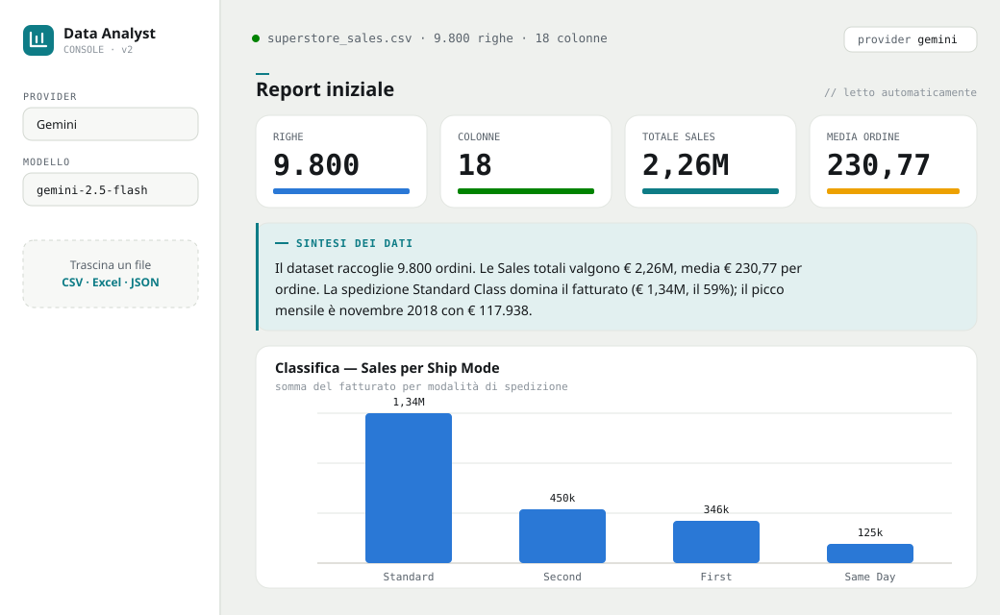
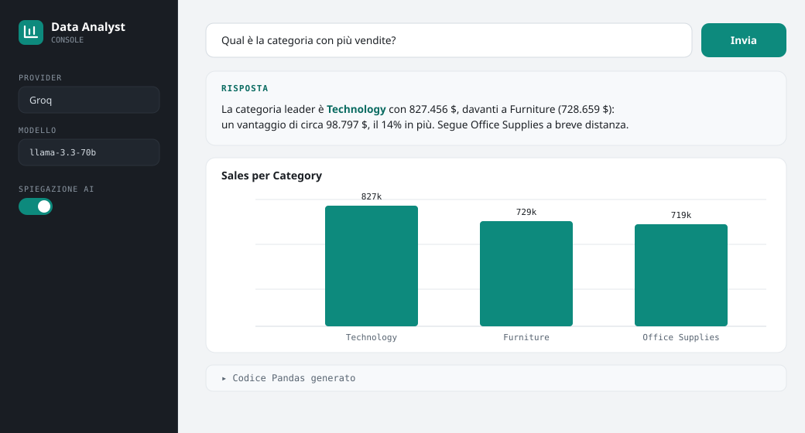

# Natural Language Data Analyst

*Analista dati AI-powered che interroghi in linguaggio naturale.*

> ▶️ **Prova la demo: https://ai-data-analyst-assistant-z.streamlit.app/**

Interroga i tuoi dati in **linguaggio naturale**. Fai una domanda — ad esempio
*"Qual è il mese con più vendite?"* oppure *"Mostrami le vendite per regione"* —
e un modello LLM la traduce in codice Pandas, che l'app esegue in una sandbox.
Ottieni il **risultato**, un **grafico Plotly interattivo** e una **risposta
testuale** che interpreta i numeri.

Al caricamento di un dataset ricevi inoltre un **report iniziale automatico**:
KPI, statistiche, classifiche, andamento temporale, **correlazioni** tra le
misure e **insight automatici** — con una sintesi in linguaggio naturale e un
**report esecutivo** scaricabile. Tutti i numeri sono calcolati in Pandas; l'AI
si limita a raccontarli.

## Anteprima




## Funzionalità

- **Domande in linguaggio naturale** → codice Pandas generato dall'LLM →
  **grafici Plotly interattivi** e tabelle di dettaglio.
- **Multi-provider LLM**: Ollama (locale, senza API key), Groq, Anthropic,
  OpenAI, Gemini. Il provider e il modello si scelgono dalla barra laterale.
- **Formati supportati**: CSV, Excel (.xlsx/.xls) e JSON. L'app si adatta allo
  schema del file caricato: rileva tipi, date e colonne "misura" in automatico,
  e passa lo schema reale al modello a ogni domanda.
- **Report iniziale automatico** con KPI, statistiche, classifiche e andamento
  temporale, più una panoramica testuale generata dall'AI.
- **Correlazioni e distribuzioni**: heatmap delle correlazioni tra le misure
  (con le coppie più forti) e istogramma della misura selezionata.
- **Insight automatici**: quota del leader, crescita di periodo, variazione
  recente e outlier — **numeri calcolati in Pandas**, non dedotti dall'AI.
- **Report esecutivo** generabile con un click (Executive Summary, Key Insights,
  Recommendations, Risks, Next Steps) e **scaricabile in Markdown**.
- **Grafici collegati (click-to-filter)**: nel report, cliccando una barra della
  classifica l'andamento temporale si filtra sulla categoria selezionata.
- **Risposta testuale** a ogni domanda: l'AI interpreta il risultato calcolato e
  risponde citando i numeri chiave.
- **Unità di misura opzionale**: puoi indicarla dalla barra laterale; per le
  misure economiche senza unità indicata viene usato il dollaro come standard.
- **Esecuzione sicura**: il codice generato è validato staticamente (analisi
  AST: niente import, I/O su file o rete, costrutti pericolosi) ed eseguito in
  un **sottoprocesso isolato con timeout**.

## Esecuzione in locale

### 1. Requisiti
- **Python 3.10+** e **git**

### 2. Installazione
```bash
git clone https://github.com/raffaeleciccone-analyst/ai-data-analyst-assistant.git
cd ai-data-analyst-assistant

python -m venv .venv
# Windows:  .venv\Scripts\activate
# macOS/Linux:  source .venv/bin/activate

pip install -r requirements.txt
```

### 3. Scegli un modello LLM *(serve un LLM per generare le analisi)*

**Opzione A — Ollama in locale (gratuito, nessuna API key)**
1. Installa Ollama da <https://ollama.com>
2. Scarica il modello: `ollama pull qwen2.5:3b`
3. È già il provider predefinito.

**Opzione B — Provider cloud (API key)**
- Scegli Groq, Anthropic, OpenAI o Gemini dalla barra laterale e incolla la tua
  API key (oppure copia `.env.example` in `.env` e inseriscila lì).
- Groq offre una chiave gratuita (senza carta) su <https://console.groq.com/keys>.

### 4. Avvia
```bash
streamlit run main.py
```
L'app si apre nel browser su <http://localhost:8501>.

## Usare i tuoi dati

All'avvio è già caricato un **dataset di esempio** (`data/sales.csv`, vendite
Superstore). Per usare i tuoi dati, carica un file CSV, Excel o JSON dalla barra
laterale: l'app rileva colonne, tipi e date automaticamente e adatta report,
KPI e domande al nuovo schema. Dalla sezione "Report" puoi scegliere la misura
e la categoria su cui basare KPI e classifiche.

## Architettura

```
main.py            interfaccia Streamlit (report, KPI, grafici collegati, chat)
core/loader.py     lettura multi-formato, profilo del dataset, analisi automatica
core/agent.py      traduzione domanda → codice Pandas (adattata allo schema)
core/executor.py   validazione AST, sandbox, esecuzione isolata, grafici Plotly
core/providers/    astrazione multi-LLM (ollama, groq, anthropic, openai, gemini)
```

Il flusso di una domanda: l'agente costruisce un prompt con lo schema reale del
dataset (nomi, tipi, esempi sanitizzati delle colonne), il provider LLM genera
il codice, l'executor lo valida via AST e lo esegue in un sottoprocesso isolato
con timeout; in caso di errore il codice viene corretto e ritentato. Il
risultato (dati e/o figura) torna all'interfaccia insieme a un riepilogo usato
dall'AI per la risposta testuale.

## Sicurezza

- **Whitelist di builtin** minimale nell'ambiente di esecuzione.
- **Analisi statica AST** del codice generato: vietati import, accessi ad
  attributi privati/dunder, metodi di I/O (`to_*`/`read_*`/`write_*` su file o
  rete) e costrutti di esecuzione dinamica (`eval`, `exec`, ...).
- **Sottoprocesso isolato** con timeout (e limite di memoria dove supportato):
  barriera di processo attorno al codice generato dall'LLM.
- I valori di esempio delle celle inseriti nel prompt sono **sanitizzati** per
  mitigare la prompt injection da file caricati.

## Deploy

Per pubblicare l'app (inclusa la modalità demo con limite di domande) vedi
[DEPLOY.md](DEPLOY.md).
