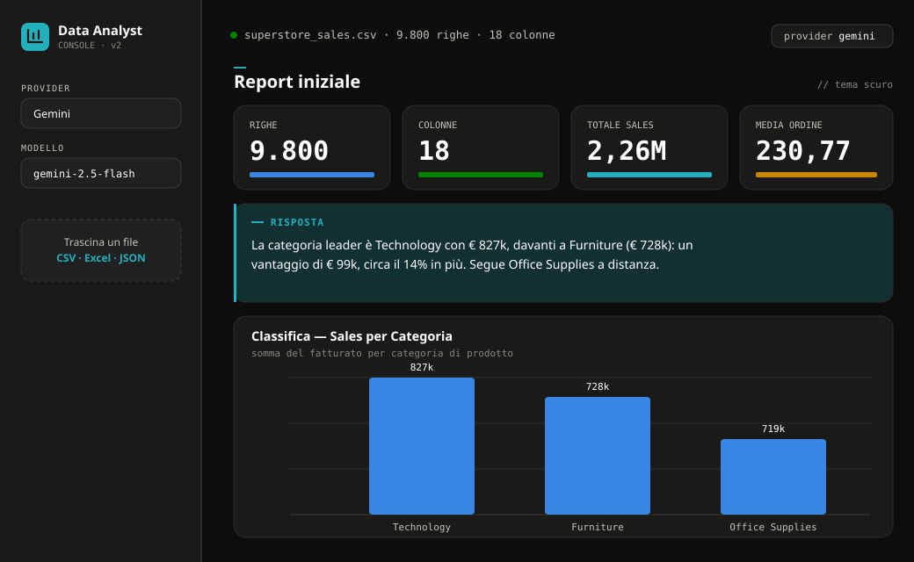

# AI Data Analyst Assistant

<!-- Dopo il deploy, aggiungi qui il link alla demo:  ▶️ **Prova la demo:** <URL> -->

Interroga i tuoi dati in **linguaggio naturale**. Fai una domanda (es. *"Qual è il
mese con più vendite?"* o *"Mostrami le vendite per regione"*), un modello LLM
traduce la richiesta in codice Pandas, l'app lo esegue in una sandbox e ti mostra
**il risultato, un grafico interattivo e una risposta testuale** che lo interpreta.

Al caricamento di un file ricevi anche un **report automatico** con statistiche,
classifiche e andamento temporale dei dati.

## Anteprima




## Cosa fa

- 📊 Domande in italiano → codice Pandas → grafici **Plotly** interattivi
- 🧠 Multi-provider LLM: **Ollama** (locale), **Anthropic**, **OpenAI**, **Gemini**
- 📁 Carica **CSV, Excel (.xlsx) o JSON** — si adatta a qualsiasi schema
- 📋 Report iniziale automatico + risposta testuale a ogni domanda
- 🌙 Tema chiaro/scuro

## Esegui il progetto in locale

### 1. Requisiti
- **Python 3.10+** e **git**

### 2. Installazione
```bash
git clone https://github.com/raffaeleciccone-analyst/ai-data-analyst-assistant.git
cd ai-data-analyst-assistant

python -m venv .venv
# Windows:  .venv\Scripts\activate
# macOS/Linux:  source .venv/bin/activate

pip install -r requirements.txt
```

### 3. Scegli un modello LLM  *(serve un LLM per generare le analisi)*

**Opzione A — Ollama in locale (gratis, nessuna API key)**
1. Installa Ollama da <https://ollama.com>
2. Scarica il modello: `ollama pull qwen2.5:3b`
3. È già il provider predefinito.

**Opzione B — Provider cloud (API key)**
- Scegli **Anthropic**, **OpenAI** o **Gemini** dalla barra laterale e incolla la
  tua API key (oppure copia `.env.example` in `.env` e inseriscila lì).
- 💡 **Gemini** ha una chiave gratuita (senza carta) su <https://aistudio.google.com/apikey>.

### 4. Avvia
```bash
streamlit run main.py
```
Si apre nel browser su <http://localhost:8501>.

## Usare i tuoi dati
All'avvio è già caricato un **dataset di esempio** (`data/sales.csv`). Per usare i
tuoi, **carica un CSV/Excel/JSON** dalla barra laterale: l'app rileva colonne, tipi
e date automaticamente.

## Come funziona
```
main.py            interfaccia Streamlit (chat, KPI, report, tema)
core/loader.py     lettura file multi-formato + profilo e analisi dei dati
core/agent.py      traduzione domanda → codice Pandas (adattata allo schema)
core/executor.py   sandbox + esecuzione isolata + grafici Plotly
core/providers/    astrazione multi-LLM (ollama/anthropic/openai/gemini)
```
Il codice generato dall'LLM viene validato (AST) ed eseguito in una **sandbox** in
un **sottoprocesso isolato con timeout**: niente accesso a file o rete.

---
*Contributi e deploy: vedi [DEPLOY.md](DEPLOY.md).*
