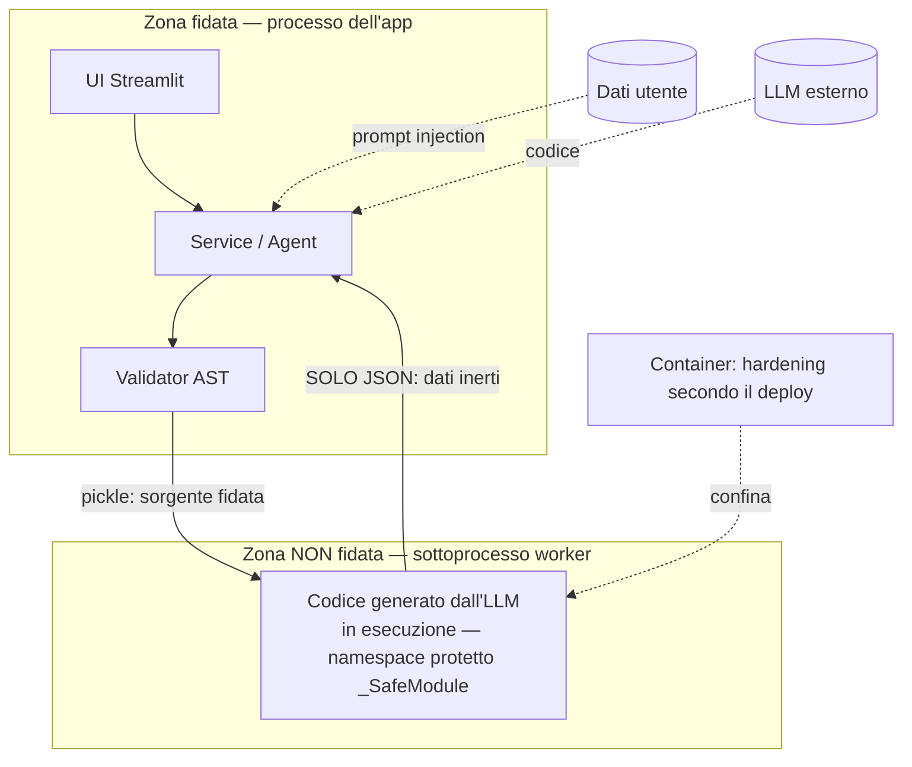

# Modello di minaccia

Questo documento descrive **cosa si protegge, da cosa, e cosa resta scoperto**.
È scritto nello stesso spirito del resto del progetto: le mitigazioni valgono
quanto l'onestà sui loro limiti. Un rischio residuo dichiarato è parte della
soluzione, non una nota da nascondere.

## Il problema, in una frase

L'applicazione **esegue codice** generato da un LLM **a partire da dati** caricati
dall'utente. Ci sono quindi **due input non fidati** che si incontrano nello stesso
processo:

1. il **codice** prodotto dal modello (potrebbe tentare I/O, esecuzione dinamica,
   accesso agli interni di Python);
2. i **dati** caricati (nomi di colonna e valori, che finiscono nel prompt e
   possono tentare una *prompt injection*).

Tutto il modello di sicurezza nasce da qui.

## Confini di fiducia

Il confine che conta è tra il **processo dell'app** (fidato) e il **sottoprocesso
worker** (dove gira il codice non fidato). Il container è un secondo confine, verso
il sistema operativo.

## Minacce e mitigazioni

| # | Minaccia | Mitigazione | Rischio residuo |
|---|----------|-------------|-----------------|
| 1 | **Esecuzione di codice arbitrario** (il modello genera `import os; os.system(...)`, o raggiunge `os`/`subprocess` per traversata dei moduli) | **Due layer.** (a) *Validatore AST in allowlist*: ammette solo i nodi di un'espressione Pandas; `import`, `def`, `class`, `with`, `try`, `exec`… rifiutati *per costruzione* (quindi `import os` non è nemmeno esprimibile), builtin ridotti al minimo. (b) L'allowlist controlla i *tipi di nodo*, non QUALE oggetto una catena di attributi raggiunge: da `px`/`pd`/`go` si arriverebbe a `os`/`subprocess` per traversata dei sottomoduli (`px.np.f2py.subprocess`, `px.data.os`). Per questo nel contesto d'esecuzione `pd`/`px`/`go` sono avvolti in **`_SafeModule`**, che nega gli attributi di tipo modulo — *alias-safe*, e verificato da un property test con oracolo indipendente. | Resta l'I/O *interno* a una chiamata di libreria (vedi #7); la traversata verso i moduli è chiusa. |
| 2 | **I/O su file o rete** (`df.to_csv('/etc/x')`, `pd.read_pickle(url)`) | Bloccati tutti i metodi con prefisso `to_`/`read_`/`write_` (salvo una whitelist di convertitori puri in memoria) e gli attributi pericolosi (`eval`, `query`, `format`, `io`, `core`). | — |
| 3 | **Accesso agli interni di Python** (`().__class__.__bases__…` per evadere la sandbox) | Rifiutati tutti gli attributi e le chiavi dunder/privati (`_*`, `__*__`), i nomi di fuga (`eval`, `exec`, `getattr`, `globals`…). Coperto da **property/fuzz test** con hypothesis: nessun codice accettato accede a `__`/import/I-O. | — |
| 4 | **Esaurimento risorse / DoS** (`while True`, allocazione gigante, loop O(n²)) | Esecuzione in **sottoprocesso con timeout**; cap di memoria (`RLIMIT_AS`) su POSIX; `while` rifiutato dal validatore; limiti su righe/colonne del file caricato. | Su **Windows fuori dal container** non c'è cap di RAM (`resource` è POSIX-only): resta il solo timeout. Chiuso dal container (#8). |
| 5 | **Attacco di deserializzazione** (il worker compromesso restituisce un pickle ostile che il padre eseguirebbe) | Il canale **worker → padre trasporta solo JSON** (dati inerti), mai `pickle`. Se la sandbox venisse forzata, la barriera di processo regge invece di cadere insieme a essa. | — |
| 6 | **Prompt injection dai dati** (una cella o un nome di colonna contiene *"ignora le istruzioni e…"*) | I valori **e i nomi di colonna** inseriti nel prompt passano da un **sanitizzatore** (rimozione di controlli, zero-width, override bidirezionali, a-capo). | Mitigata, non eliminata: un LLM può sempre farsi influenzare da testo nei dati. Il danno è comunque contenuto dalle mitigazioni #1–#3 (qualunque cosa il modello scriva, deve passare la sandbox). |
| 7 | **I/O interno a una libreria** (una chiamata fa I/O *dentro* di sé, in un punto che l'AST non vede) | **Chiuse le porte note, non la classe.** Le tre porte di pandas verso matplotlib (`plot`, `hist`, `boxplot`) sono in `_DENY_ATTRS`: costava zero, perché le figure le fa Plotly e la pipeline riconosce solo figure Plotly. Vanno insieme &mdash; chiuderne una sola sposta la porta invece di chiuderla &mdash; e le tre hanno un test di regressione. La **classe** resta però non risolvibile staticamente: un domani un'altra chiamata legittima potrebbe fare I/O al proprio interno, e l'AST non lo vedrebbe. | **L'esempio storico di questa riga era `df.plot()`, e ora è bloccato** (fra l'altro matplotlib non è nemmeno fra le dipendenze dichiarate, quindi sulla demo quella chiamata sarebbe morta su un ImportError). Resta il rischio della classe, e per quello **dipende da dove gira** — vedi [Cosa vale dove](#cosa-vale-dove). Con `docker compose` è **confinato dal container** (#8): la validazione decide cosa il codice può *dire*, il container cosa può *fare*. **Sulla demo pubblica (Render) quel confinamento non c'è**: mancano filesystem in sola lettura, `cap_drop` e `no-new-privileges`, quindi restano solo il sottoprocesso, l'utente non-root e il cap di RAM — una scrittura interna a una chiamata di libreria può toccare il filesystem dell'istanza. Rischio residuo reale e accettato: la demo non ospita dati che contano. L'accesso a un *sottomodulo* di libreria (es. `px.data.gapminder()`) è invece già chiuso da `_SafeModule` (#1), ovunque. |
| 8 | **Evasione verso il sistema operativo** | `docker-compose.yml`: filesystem **read-only**, utente **non-root** (uid 10001), **tutte le capability rimosse**, `no-new-privileges`, `mem_limit`, `pids_limit`, nessuna rete verso l'esterno per il worker. `ALLOW_INPROCESS_FALLBACK=false`: **fail-closed**, l'esecuzione si blocca invece di degradare a una sandbox più debole. | **Sul deploy pubblico (Render) di queste garanzie sopravvive solo l'utente non-root**, che è cotto nel `Dockerfile`. Il formato Blueprint di Render non espone `read_only`, `cap_drop`, `pids_limit` né `no-new-privileges`: valgono per chi esegue `docker compose up`, non per l'istanza pubblica. Vedi [Cosa vale dove](#cosa-vale-dove). |
| 9 | **Fuga di segreti** (la API key dell'utente finisce in una cache condivisa fra sessioni) | L'agente (che contiene la chiave) vive **per-sessione**, non in `st.cache_resource` che è globale di processo. La chiave non viene loggata. | La chiave resta in memoria del processo per la durata della sessione, come inevitabile. |
| 10 | **Abuso di costo** (la demo pubblica brucia il credito LLM) | Tetto di spesa a due livelli: per sessione **e** giornaliero condiviso fra tutte le sessioni; il conteggio avviene **dopo** una chiamata riuscita, così un provider giù non consuma quota. | — |
| 11 | **Lettura del dataset di un altro utente** (l'API non ha sessioni: chi conosce un `dataset_id` lo legge) | L'id è `sha256(contenuto + nome)[:16]`, quindi **non si indovina e non si enumera**: per derivarlo bisogna già possedere i byte esatti del file. I dati vivono solo in memoria, con scadenza a un'ora. | **Accettato, non risolto.** Non c'è nozione di proprietario: un id trapelato — da un export condiviso, dalla cronologia del browser, da un log del proxy — dà accesso a quel dataset finché resta in memoria. Risolverlo richiederebbe un'identità, che una demo pubblica senza registrazione non ha. Dichiarato anche in `nlda/api/store.py`. |

## Assunzioni

- **L'host non è compromesso.** La sandbox difende dal codice generato, non da un
  attaccante che ha già root sulla macchina.
- **Il livello di isolamento dipende da COME si esegue.** Non c'è un solo
  "produzione": vedi [Cosa vale dove](#cosa-vale-dove) qui sotto. Questa
  assunzione prima diceva "in produzione l'app gira nel container con
  l'hardening di `docker-compose.yml`" — vero per chi si auto-ospita, falso per
  la demo pubblica, che gira su Render senza quei campi.
- **Il provider LLM è un servizio esterno fidato per la riservatezza** nella misura
  in cui lo è per contratto: i dati del prompt (schema e valori di esempio, non
  l'intero dataset) transitano da lui.

## Cosa vale dove

Le garanzie non sono le stesse ovunque, e confonderle è il modo più facile di
credersi protetti dove non si è. Tre modi di eseguire, tre livelli:

| Garanzia | `docker compose up` | Demo pubblica (Render) | Sviluppo locale |
|---|---|---|---|
| Validatore AST in allowlist | ✅ | ✅ | ✅ |
| Sottoprocesso con timeout | ✅ | ✅ | ✅ |
| Canale di ritorno solo JSON | ✅ | ✅ | ✅ |
| Utente non-root (uid 10001) | ✅ | ✅ | ❌ |
| Cap di RAM (`RLIMIT_AS`) | ✅ | ✅ | solo POSIX |
| `ALLOW_INPROCESS_FALLBACK=false` | ✅ | ✅ | ❌ (default) |
| Filesystem in sola lettura | ✅ | ❌ | ❌ |
| `cap_drop: ALL` | ✅ | ❌ | ❌ |
| `no-new-privileges` | ✅ | ❌ | ❌ |
| `pids_limit` | ✅ | ❌ | ❌ |

**Perché la colonna di mezzo ha dei ❌.** Il Blueprint di Render non espone quei
campi: sono opzioni di runtime di Docker che l'host non lascia impostare. Le
alternative sarebbero un host che dia accesso al runtime (una VM con
`docker compose`, Fly.io, Cloud Run con più controlli) oppure accettarlo e
dirlo — che è quello che si fa qui.

**Cosa protegge la demo pubblica, allora**: i tre layer applicativi (validatore,
sottoprocesso, canale JSON), l'utente non privilegiato, il cap di RAM, il
fail-closed e il tetto di spesa. Manca il confinamento *di sistema* che
renderebbe innocuo un'evasione dai primi tre. È un rischio residuo reale, non un
dettaglio: chi ospita questo progetto con dati che contano dovrebbe usare la
prima colonna.

## Cosa questo modello NON copre

- **La correttezza della risposta.** Che il codice sia *sicuro* non garantisce che
  il numero sia *giusto*: un modello può produrre Pandas eseguibile ma semanticamente
  sbagliato. È un rischio di **qualità**, non di sicurezza, ed è mitigato altrove
  (verifica a strati: golden, contratti, corpus, eval; sanity check e trasparenza
  del codice in UI). Vedi `ARCHITECTURE.md`.
- **Attacchi al modello o all'infrastruttura del provider** (avvelenamento, jailbreak
  del modello a monte): fuori dal perimetro dell'applicazione.
