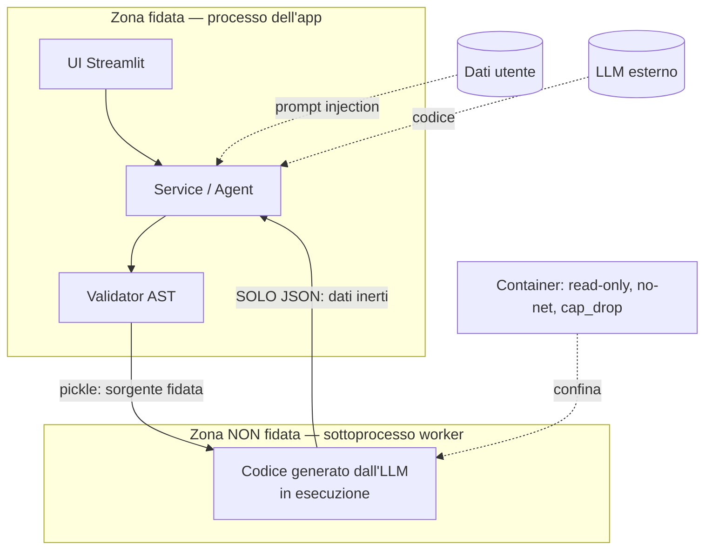

# Modello di minaccia

Questo documento descrive **cosa si protegge, da cosa, e cosa resta scoperto**.
È scritto nello stesso spirito del resto del progetto: le mitigazioni valgono
quanto l'onestà sui loro limiti. Un rischio residuo dichiarato è parte della
soluzione, non una nota da nascondere.

## Il problema, in una frase

L'applicazione **esegue codice** generato da un LLM **a partire da dati** caricati
dall'utente. Ci sono quindi **due input non fidati** che si incontrano nello stesso
processo:

1. il **codice** prodotto dal modello (potrebbe tentare I/O, esecuzione dinamica,
   accesso agli interni di Python);
2. i **dati** caricati (nomi di colonna e valori, che finiscono nel prompt e
   possono tentare una *prompt injection*).

Tutto il modello di sicurezza nasce da qui.

## Confini di fiducia

Il confine che conta è tra il **processo dell'app** (fidato) e il **sottoprocesso
worker** (dove gira il codice non fidato). Il container è un secondo confine, verso
il sistema operativo.

## Minacce e mitigazioni

| # | Minaccia | Mitigazione | Rischio residuo |
|---|----------|-------------|-----------------|
| 1 | **Esecuzione di codice arbitrario** (il modello genera `import os; os.system(...)`) | Validatore AST in **allowlist**: ammette solo i nodi di un'espressione Pandas; `import`, `def`, `class`, `with`, `try`, `exec`… sono rifiutati *per costruzione*, compresi i costrutti futuri del linguaggio. Builtin ridotti a una whitelist minima. | La sintassi è controllata, non l'I/O *interno* a una chiamata di libreria (vedi #7). |
| 2 | **I/O su file o rete** (`df.to_csv('/etc/x')`, `pd.read_pickle(url)`) | Bloccati tutti i metodi con prefisso `to_`/`read_`/`write_` (salvo una whitelist di convertitori puri in memoria) e gli attributi pericolosi (`eval`, `query`, `format`, `io`, `core`). | — |
| 3 | **Accesso agli interni di Python** (`().__class__.__bases__…` per evadere la sandbox) | Rifiutati tutti gli attributi e le chiavi dunder/privati (`_*`, `__*__`), i nomi di fuga (`eval`, `exec`, `getattr`, `globals`…). Coperto da **property/fuzz test** con hypothesis: nessun codice accettato accede a `__`/import/I-O. | — |
| 4 | **Esaurimento risorse / DoS** (`while True`, allocazione gigante, loop O(n²)) | Esecuzione in **sottoprocesso con timeout**; cap di memoria (`RLIMIT_AS`) su POSIX; `while` rifiutato dal validatore; limiti su righe/colonne del file caricato. | Su **Windows fuori dal container** non c'è cap di RAM (`resource` è POSIX-only): resta il solo timeout. Chiuso dal container (#8). |
| 5 | **Attacco di deserializzazione** (il worker compromesso restituisce un pickle ostile che il padre eseguirebbe) | Il canale **worker → padre trasporta solo JSON** (dati inerti), mai `pickle`. Se la sandbox venisse forzata, la barriera di processo regge invece di cadere insieme a essa. | — |
| 6 | **Prompt injection dai dati** (una cella o un nome di colonna contiene *"ignora le istruzioni e…"*) | I valori **e i nomi di colonna** inseriti nel prompt passano da un **sanitizzatore** (rimozione di controlli, zero-width, override bidirezionali, a-capo). | Mitigata, non eliminata: un LLM può sempre farsi influenzare da testo nei dati. Il danno è comunque contenuto dalle mitigazioni #1–#3 (qualunque cosa il modello scriva, deve passare la sandbox). |
| 7 | **I/O interno a una libreria** (`px.data.gapminder()`, `df.plot()` fanno I/O *dentro* la chiamata, invisibile all'AST) | Non risolvibile staticamente. | **Confinato dal container** (#8): la validazione decide cosa il codice può *dire*, il container cosa può *fare*. |
| 8 | **Evasione verso il sistema operativo** | `docker-compose.yml`: filesystem **read-only**, utente **non-root** (uid 10001), **tutte le capability rimosse**, `no-new-privileges`, `mem_limit`, `pids_limit`, nessuna rete verso l'esterno per il worker. `ALLOW_INPROCESS_FALLBACK=false`: **fail-closed**, l'esecuzione si blocca invece di degradare a una sandbox più debole. | L'hardening è **responsabilità del deploy**: fuori dal container queste garanzie non ci sono (vedi Assunzioni). |
| 9 | **Fuga di segreti** (la API key dell'utente finisce in una cache condivisa fra sessioni) | L'agente (che contiene la chiave) vive **per-sessione**, non in `st.cache_resource` che è globale di processo. La chiave non viene loggata. | La chiave resta in memoria del processo per la durata della sessione, come inevitabile. |
| 10 | **Abuso di costo** (la demo pubblica brucia il credito LLM) | Tetto di spesa a due livelli: per sessione **e** giornaliero condiviso fra tutte le sessioni; il conteggio avviene **dopo** una chiamata riuscita, così un provider giù non consuma quota. | — |

## Assunzioni

- **L'host non è compromesso.** La sandbox difende dal codice generato, non da un
  attaccante che ha già root sulla macchina.
- **In produzione l'app gira nel container** con l'hardening di `docker-compose.yml`.
  Fuori dal container (sviluppo locale) le garanzie a livello di sistema (#8) e il
  cap di RAM su Windows (#4) non valgono: è un ambiente di sviluppo, non di deploy.
- **Il provider LLM è un servizio esterno fidato per la riservatezza** nella misura
  in cui lo è per contratto: i dati del prompt (schema e valori di esempio, non
  l'intero dataset) transitano da lui.

## Cosa questo modello NON copre

- **La correttezza della risposta.** Che il codice sia *sicuro* non garantisce che
  il numero sia *giusto*: un modello può produrre Pandas eseguibile ma semanticamente
  sbagliato. È un rischio di **qualità**, non di sicurezza, ed è mitigato altrove
  (verifica a strati: golden, contratti, corpus, eval; sanity check e trasparenza
  del codice in UI). Vedi `ARCHITECTURE.md`.
- **Attacchi al modello o all'infrastruttura del provider** (avvelenamento, jailbreak
  del modello a monte): fuori dal perimetro dell'applicazione.
